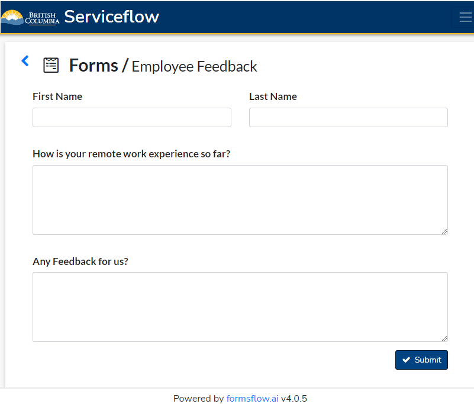

- Start Date: 2022-09-14
- Target Major Version: 
- Reference Issues: [13427](https://app.zenhub.com/workspaces/sre-team-space-61685e965bfb35001dac5771/issues/bcgov/entity/13427)
- Implementation PR: (leave this empty)

# Summary

In Name Request we are using Hotjar to receive client feedback.  Currently it is the only application that uses Hotjar.  We have a requirement to add a common feedback component to all of
the applications.  We can continue to use Hotjar or switch to Google Forms/Microsoft Forms, or the Feedback UI/API used by Service Delivery CCII.

For each tool we need to figure out:
1) Pricing/User
2) How to manage the Feedback - (Data storage, Reporting, Actioning, etc.)
3) Integration Time, Maintenance

# Sample Form design

# Current Hotjar Feedback

# CCII Forms

Business Process Model Notation for CCII

External User Feedback Interface:

Staff Feedback Interface:

# Google Forms

# Microsoft Forms

# Detailed specs

- Hotjar
1) Pricing/User (Patrick, can you fill this in, current price, and price per application)
2) How to manage the Feedback - Currently emails are being sent to staff with feedback.  Not sure what percent is actioned.
3) Very low integration time and Maintenance

- CCII

1) FormsFlow.io is free to use currently, may have cost for Service Delivery if purchased for entire ministry
2) How to manage the Feedback - Service BC already manages all the feedback data and formsflow, we would implement a coordinated Feedback Data Warehouse/Reporting strategy
3) AOT Developer maybe needed for Integration Time and Maintenance (1 FTE/Contractor needed)

- Google Forms

1) We already have Google Workspace licence.  Patrick would we need one per developer, multiply current cost by number of developers creating forms.
2) UI Friendly - Yes
3) How to manage the Feedback - would need to create Data Warehouse/Data Lake on GCP to store all the feedback
4) Medium Integration Time and Maintenance (1 FTE/Contractor needed)

- Microsoft Forms
1) Part of Office 365 - can be accessed through the web
2) Creating Simple Forms - Responses would be store online (not in DB)
3) How to manage the Feedback - would need to create Data Warehouse/Data Lake on GCP (or openshift PostgresSql DB) to store all the feedback
4) Medium Integration Time and Maintenance (1 FTE/Contractor needed)

**Decision required**
To make a decision whether to keep Hotjar, or implement a new solution CCII, Google Forms, or Microsoft Forms.

# Adoption strategy

The _SRE_ team will create a story to implement the required components across all applications.

# Unresolved questions

N/A

# Thanks

A special thanks to Patrick Wei and the SRE Team for assisting in the creation of this RFC.
